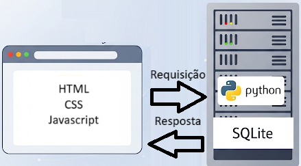

# simple-blog-python

Este repositório tem por finalidade a criação de um blog apenas para fins didáticos, promovendo um melhor entendimento sobre os fundamentos da web.  
O foco aqui é o desenvolvimento de uma aplicação que permita a qualquer pessoa, mesmo sem nenhum conhecimento em tecnologia, compreender os fundamentos básicos do funcionamento da web e até mesmo aplicar esse conhecimento em projetos pessoais.  
Se você sempre se interessou em entender como a web funciona, este guia visa não só explicar os conceitos de maneira simples, como também fornecer a oportunidade de colocar a mão na massa, sem medo de errar.

# Fase 1 - Conceitos e Ferramentas

## Spiderman, Spiderman, Does whatever a spider can

Web é simplesmente a palavra em inglês para teia, como as teias de aranha. Aranhas, embora muitas vezes assustadoras e algumas vezes perigosas, são animais fascinantes. Possuem muitos tipos de teias, com diversos formatos e funções.  
Mas, para exemplificar, vamos pensar na famosa teia em formato circular, usada para alimentação de algumas espécies de aranha.

A aranha tece sua teia e fica parada no centro, aguardando algum inseto voador desavisado se prender na teia. Por meio de suas patas e corpo, ela consegue sentir as vibrações dos fios enquanto o inseto se debate e saber exatamente onde ele se encontra. A teia de aranha é, portanto, uma **rede de informação** para a aranha.

Trazendo para o contexto da web, o **usuário** é a aranha no centro da teia. Cada fio da teia é um **cabo ou conexão wireless**, e cada inseto preso é **outro computador**, chamado de **servidor**, trocando informações com a rede.

Assim como a aranha caminha até o inseto desejado por meio de um fio específico para consumi-lo, seu computador, via **browser**, segue até o **servidor** pelo endereço que você digita e **consome** a informação, exibindo-a em sua tela.

## Deixemos as aranhas e falemos de cobras

*"Tá bom, muita palestrinha, mas na prática, como isso acontece?"*

A melhor maneira de entender o funcionamento da web é colocando a mão na massa. Para isso, vamos criar um projeto: um site simples e funcional. Aqui optamos por um site do tipo blog, pois teremos assim uma melhor visualização de conceitos que serão apresentados mais à frente, como **frontend** e **backend**.

A primeira coisa que você deve fazer é instalar o Python em sua máquina.  
*"Mas Rafael, o que é Python?"*

Python é uma linguagem de programação simples e minimalista, muito vantajosa para iniciantes e com farta documentação. Embora este não seja um guia sobre Python, explicaremos passo a passo cada linha de código e vamos entender juntos o que cada uma faz. **Lidaremos com uma cobra domesticada**.

Visite o endereço oficial do [Python](https://www.python.org/downloads/) e siga as instruções de instalação para seu sistema operacional.  
Em seguida, você precisará instalar uma **IDE**, sigla em inglês para **Ambiente de Desenvolvimento Integrado**. Pode realizar o download da que preferir, mas eu aconselho o [Visual Studio Code](https://code.visualstudio.com/download), por ser muito interessante para iniciantes e por ter muitas ferramentas para várias linguagens de programação.

Caso tenha dificuldades, recomendo que siga o tutorial em vídeo [Como Instalar Python e Visual Studio Code no Windows | Python do Jeito Certo 2.0](https://youtu.be/R9dLGLVqK9Q) do canal Programação Dinâmica, onde é feito o passo a passo tanto da instalação do Python quanto do VS Code.

## OBJETIVO: Criar um Blog Simples com Python Vanilla, SQLite e Frontend Básico

Após a instalação do Python, vamos começar a construção do nosso blog funcional, utilizando apenas as bibliotecas padrão do **Python**, o sistema de banco de dados **SQLite** e as tecnologias essenciais de frontend: **HTML, CSS e JavaScript**.  
*"Mas Rafael, o que é tudo isso?"*

Basicamente, **Frontend** é a parte visual e interativa de um site ou aplicativo com a qual o usuário interage diretamente, enquanto **Backend** é a estrutura interna que gerencia os dados e a lógica para que tudo funcione nos bastidores.

Ao acessar um site, o **frontend** (seu navegador) requisita a página a um servidor (o **backend**), que por sua vez processa a solicitação, busca as informações necessárias e as envia de volta para o frontend exibi-las de forma visual e interativa na sua tela.

O **Python** e o banco de dados **SQLite** vão trabalhar do lado do **servidor**. O **HTML, CSS e JavaScript**, do lado do **navegador**.

Este guia passo a passo, portanto, demonstra como criar uma aplicação web leve e **sem a necessidade de frameworks prontos**, ideal para projetos pessoais e para aprofundar o conhecimento nos fundamentos do desenvolvimento web.

## O que aprendemos até aqui

* **A Web como uma Teia de Aranha** 🕸️: Aprendemos uma analogia onde a web é uma teia de informação, o **usuário** é a aranha, as **conexões** são os fios e os **servidores** são como outros computadores na rede, dos quais "consumimos" informações através do navegador.
***
* **O que é Frontend e Backend**: Entendemos a diferença fundamental entre os dois.
    * **Frontend** é a parte visual e interativa com a qual o usuário interage diretamente no navegador.
    * **Backend** é a estrutura interna, o servidor, que gerencia os dados e a lógica para que o site funcione.
***
* **Como Frontend e Backend se Comunicam**: Vimos que, ao acessar um site, o seu navegador (**frontend**) faz uma requisição a um servidor (**backend**), que processa o pedido e envia as informações de volta para serem exibidas na sua tela.
***
* **As Ferramentas do Nosso Projeto** 🛠️: Fomos apresentados às tecnologias que serão usadas para criar nosso blog.
    * No **Backend** (lado do servidor), usaremos a linguagem **Python** e o banco de dados **SQLite**.
    * No **Frontend** (lado do navegador), usaremos **HTML, CSS e JavaScript**.
***
* **Foco nos Fundamentos**: O objetivo do projeto é construir uma aplicação web completa **sem usar frameworks prontos**, para que possamos compreender profundamente os conceitos básicos do desenvolvimento web.

## Conclusão da parte 1

Com isso, concluímos a primeira parte do nosso projeto: ambientação com conceitos e ferramentas. Na próxima parte, vamos construir de fato o código, explicando todos os conceitos passo a passo. Se houve algo que não compreendeu, não se preocupe, isso é normal. Cada um dos conceitos apresentados será detalhado nas próximas fases do projeto.